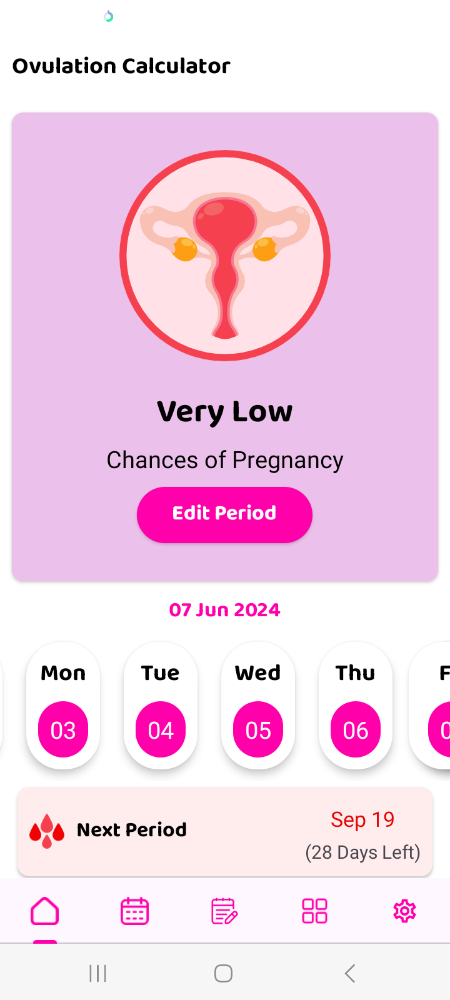
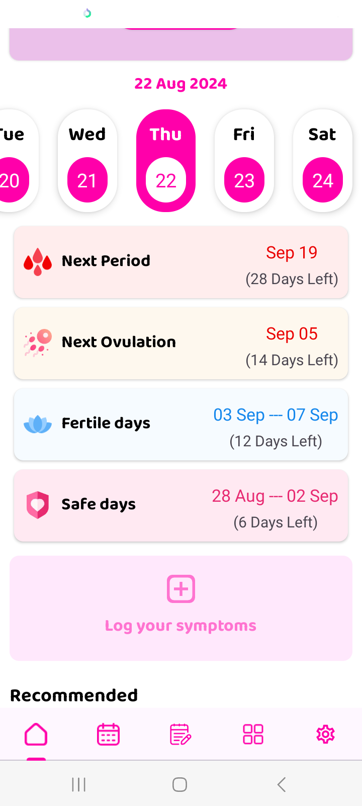

# PeriodTracker App


## 📲 Download the APK:
<a href="https://github.com/samyak2403/PeriodTracker/raw/master/app/release/app-release.apk">
  
   
</a>

  <video width="640" height="360" controls>
        <source src="https://rr5---sn-gwpa-o5br.googlevideo.com/videoplayback?expire=1724945262&ei=7iLQZr_lBcyIn88P3Of8cA&ip=152.57.7.233&id=3274b712c4bf4f7d&itag=18&source=blogger&xpc=Egho7Zf3LnoBAQ%3D%3D&mh=Gw&mm=31&mn=sn-gwpa-o5br&ms=au&mv=m&mvi=5&pcm2cms=yes&pl=19&susc=bl&eaua=ltUL3mg8rgI&mime=video/mp4&vprv=1&rqh=1&dur=48.785&lmt=1724896717551427&mt=1724916078&txp=1311224&sparams=expire,ei,ip,id,itag,source,xpc,susc,eaua,mime,vprv,rqh,dur,lmt&sig=AJfQdSswRQIgA3iBA7_E6HqXUlPUjymEU2NEgxwL7P4xb4pAIFjtX_oCIQDOoaTFZ_O4hQLhxJKL0tUDRPJaTBNKa0fdB0FJtpvybQ%3D%3D&lsparams=mh,mm,mn,ms,mv,mvi,pcm2cms,pl&lsig=AGtxev0wRAIgG2IsYi14Y5dRrTNNZTwPBGN4he1I0V_NV5qRbI2TAJQCICLFCvPWSyL1GEvWf0b5W76E0B5NB1AQyGoXIUcEVUrP&cpn=Mkk5mWp5bBVSGh93&c=WEB_EMBEDDED_PLAYER&cver=1.20240826.01.00" type="video/mp4">
        Your browser does not support the video tag.
    </video>

## Overview

PeriodTracker is a comprehensive Android application designed for women to track their menstrual cycles, sexual health, and pregnancy-related information. This app provides features that empower users to understand their bodies better and manage their reproductive health effectively.

## Features

## Screenshots


|  |  |
|--------------|--------------|
|  |  |
|  |  |
|  |  |
|  |  |
|  |  |
|  |  |
|  |  |
|  |  |

### Menstrual Cycle Tracking
- **Period Logging:** Easily log the start and end dates of your menstrual cycle.
- **Cycle Length Tracking:** Monitor the length of your cycles over time to identify patterns.
- **Cycle Predictions:** Predict your next period based on historical data, providing estimated dates and alerts.

### Fertility and Ovulation
- **Ovulation Prediction:** Estimate your ovulation days to help plan or avoid pregnancy.
- **Fertility Window Calculator:** Identify your most fertile days using the calendar feature, aiding in family planning.

### Sexual Health
- **Sexual Activity Tracker:** Log sexual encounters and related information to monitor your sexual health.
- **Contraceptive Tracking:** Record contraceptive methods used, their effectiveness, and any side effects.

### Pregnancy Features
- **Pregnancy Tracker:** If you conceive, track your pregnancy week-by-week with helpful insights and milestones.
- **Due Date Calculator:** Calculate your estimated due date based on your last menstrual period.
- **Health Tips:** Receive personalized tips for prenatal health and nutrition during pregnancy.

### Symptoms and Mood Tracking
- **Symptom Logging:** Track symptoms like cramps, mood swings, headaches, and other menstrual-related issues.
- **Mood Journal:** Maintain a mood diary to identify patterns related to your menstrual cycle and overall well-being.

### Reminders and Notifications
- **Custom Reminders:** Set reminders for upcoming periods, ovulation days, and contraceptive intake.
- **Health Tips Notifications:** Receive health tips and advice tailored to your menstrual cycle phase.

### Data Insights
- **Health Reports:** Generate reports summarizing your cycle data, symptoms, and other tracked information.
- **Data Export:** Easily export your data in CSV or PDF formats for sharing with healthcare professionals.

### Privacy and Security
- **Data Security:** Your data is securely stored, with options for password protection and data backup.
- **Anonymized Data:** Option to contribute anonymized data to research on women’s health.

## Installation

1. **Clone the repository:**

   ```bash
   git clone https://github.com/samyak2403/PeriodTracker.git
   cd PeriodTracker


   ## Open the Project in Android Studio

1. **Open the Project:**
   - Go to `File > Open` and select the `PeriodTracker` project directory.
   
2. **Build the Project:**
   - Sync Gradle files and build the project.
   
3. **Run the App:**
   - Connect your Android device or start an emulator.
   - Click on the "Run" button in Android Studio to install and launch the app on your device.

Contributing

We welcome contributions to the PeriodTracker app! If you have ideas for new features or improvements, please submit a pull request or open an issue on GitHub.

## License

This project is licensed under the MIT License. See the [LICENSE](LICENSE) file for more details.


## Contact

For any questions or suggestions, please contact Samyak Kamble.
